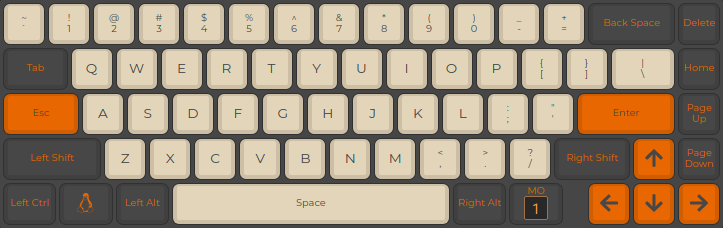
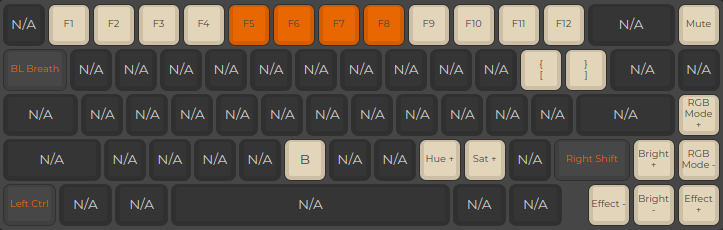

# Drop ALT - sjugge

Documentation and info on customization and overrides of the `default` Drop ALT firmware.

## Layout

### Layer 0

Alterations from the default layout.

* `KC_ESC` is mapped to Caps Lock
* `KC_GRV` is mapped to Escape

Layer 0 layout,

### Layer 1

* `Left Ctrl`: Linux Unicode input trigger (required patching `tmk_core/protocol/arm_atsam/i2c_master.{c,h}` ([#9733](https://github.com/qmk/qmk_firmware/issues/9733) & [#10728](https://github.com/qmk/qmk_firmware/pull/10728)).
* `[` | `]`: Mapped to experimental switches to lock in key/board patterns.

# References

* Layout images sourced from [config.qmk.fm](https://config.qmk.fm/#/massdrop/alt/LAYOUT_65_ansi_blocker)
* Some custom patterns sourced from [#9827](https://github.com/qmk/qmk_firmware/pull/9827) / [this post](https://www.reddit.com/r/olkb/comments/hxtuf7)
