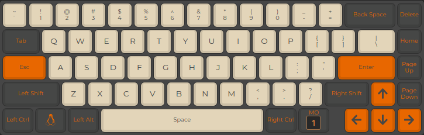
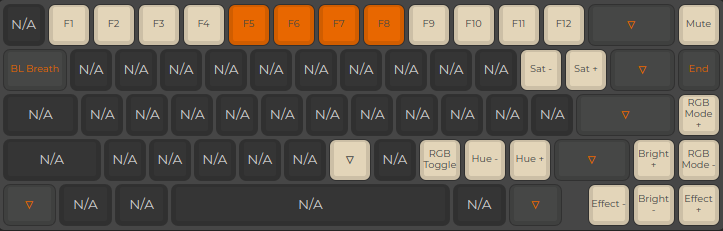

# Drop ALT - sjugge

Documentation and info on customization and overrides of the `default` Drop ALT firmware.

## Layout

### Layer 0

Alterations from the default layout.

* `KC_ESC` is mapped to Caps Lock
* `KC_GRV` is mapped to Escape
* Right CTRL is mapped to Right ALT



Layer 0 layout,

### Layer 1

* `Left Ctrl`: Linux Unicode input trigger (required patching `tmk_core/protocol/arm_atsam/i2c_master.{c,h}` ([#9733](https://github.com/qmk/qmk_firmware/issues/9733) & [#10728](https://github.com/qmk/qmk_firmware/pull/10728)).



# Compile & flash firmware

## Compile

```bash
qmk compile -kb massdrop/alt -km sjugge
```

Or use `qmk compile` if the `massdrop/alt` and `sjugge` keymap is set in qmk.in

## Mdloader

From where `applet-mdflash.bin` & `mdloader_linux` is available, run:

```bash
./mdloader_linux --download <path-to>/qmk_firmware/.build/massdrop_alt_sjugge.bin -p <port> --restart
```

# References

* Layout images sourced from [config.qmk.fm](https://config.qmk.fm/#/massdrop/alt/LAYOUT_65_ansi_blocker) ([keymap.json](./.docs/keymap.json)).
* Some custom patterns sourced from [#9827](https://github.com/qmk/qmk_firmware/pull/9827) / [this post](https://www.reddit.com/r/olkb/comments/hxtuf7).
